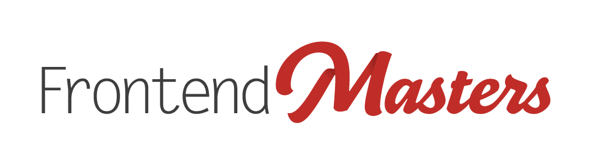

# You Might Not Need a Framework

This repo is a companion to the [You Don't Need That Library][course] course on Frontend Masters.

[][fem]

[Please click here][website] to head to the course website.

[fem]: https://www.frontendmasters.com
[website]: https://firtman.github.io/vanilla/
[course]: https://frontendmasters.com/courses/vanilla-js-apps/

## Running the project

-   Prerequisites

    -   Node.js
    -   NPM

-   Steps to run the project
    -   npm install
    -   npm run start
-   Access the application

    Open web browser and navigate to http://localhost:8080
